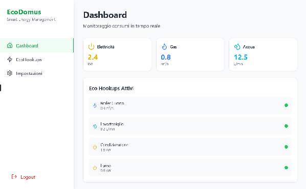
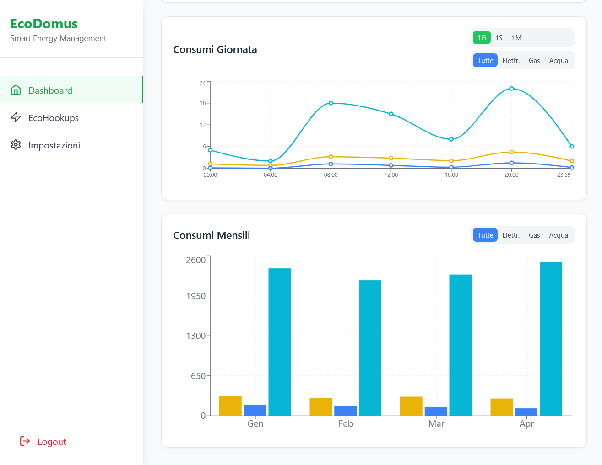

# EcoConn
## Profilo aziendale
EcoConn (EC) è una startup che si sta specializzando in soluzioni smart per la gestione dei consumi domestici, progettando e realizzando dispositivi intelligenti che permettono di monitorare in tempo reale l'uso di acqua, gas ed energia elettrica. Il prodotto principale è la linea “Eco Hookup” (EH): allacciature smart, che raccolgono dati sui consumi delle principali utenze (gas, acqua e luce) e li rendono disponibili tramite una piattaforma web (“EcoDomus”). L’obiettivo di EC è aiutare le persone a risparmiare, ridurre sprechi e semplificare il controllo delle utenze di casa.

## EcoDomus
EcoDomus è una piattaforma web progettata per la visualizzazione e il monitoraggio dei dati generati dai EH. Sviluppata internamente dal reparto software, la piattaforma è operativa da quattro mesi ed è attualmente utilizzata in ambiente domestico, tramite l’installazione di un mini server presso le abitazioni dei clienti. Nel mini server è installata la versione più aggiornata di EcoDomus ed include un sistema di comunicazione integrato che consente di interfacciarsi con i dispositivi EH. La piattaforma offre una dashboard consente di visualizzare in tempo reale i consumi attuali dei principali consumi (gas, luce e acqua), accompagnata da grafici interattivi che permettono di analizzare l’andamento dei consumi. Oltre alla dashboard, la piattaforma include una sezione dedicata alla gestione degli EH registrati, attraverso la quale l’utente può:

- Registrare nuovi EH rilevati dal mini server assegnandogli un nome
- Modificare il nome degli EH registrati
- Eliminare gli EH non più attivi

Inizialmente, ogni piattaforma viene configurata con un account con credenziali di default, modificabili dal pannello impostazioni della piattaforma.

### **Funzionalità**
Qui sotto sono riportate nel dettaglio le funzionalità attuali della piattaforma:

1. Gestione utente
   1. Modifica delle credenziali
   2. Login
   3. Logout
2. Gestione degli EH
   1. Registrazione
   2. Modifica
   3. Rimozione
3. Comunicazione con EH registrati
   1. Ricezioni dati
   2. Elaborazione dei dati
4. Visualizzazione stato degli EH
   1. Lista di EH che stanno consumando, con relativo consumo
5. Monitoraggio dei Consumi
   1. Contatori in tempo reale per gas, luce e acqua
   2. Grafico lineare per seguire l’andamento dei consumi attuali
6. Controllo dei consumi
   1. Grafico a barre per consultare i dati storici dei consumi.

### **Architettura**

Dato il set di skill del reparto software di EC, EcoDomus è stata sviluppata con lo stack MEVN (MongoDB, Express, Vue e Node) ed è stato sviluppato come monolite principalmente per ragioni legate ai tempi di sviluppo e all’assenza di una figura dedicata all’architettura software all'interno del team.

### **Approccio nello sviluppo**
Nonostante l’assenza di una architettura solida, lo sviluppo ha seguito buone pratiche di scrittura del codice, con particolare attenzione a test automatizzati e documentazione, integrati all'interno di un approccio DevOps. Lo sviluppo è stato svolto da tutto il team attuale, seguendo un modus operandi Agile, con un approccio Scrum, che ha portato il prodotto da zero alla sua implementazione base attuale. Per permette una maggiore collaborazione tra i programmatori, migliorando le competenze orizzontali del team, ogni membro ha lavorato come figura full stack occupandosi sia del front-end che del back-end.

### **Schermata dashboard**

   
   

Schermate principali della dashboard EcoDomus.

## Struttura organizzativa
- Amministratore delegato: si occupa della parte amministrativa. Ha un ruolo marginale siccome si occupa di più aziende contemporaneamente e già consolidate nel mercato.
- Project manager e CTO: senior dev che si occupa della gestione dei prodotti di EC.
- Team di sviluppo software e dispositivi: è costituito da 3 neo laureati e un laureando in ingegneria informatica, oltre che dal PM che si occupa di validare il codice prodotto dal team e dirigere il lavoro. Si occupa di realizzare sia i prodotti software, come EcoDomus, che i dispositivi fisici come le Eco Hookup.
- Responsabile prodotto con esperienza commerciale: si occupa, nella fase iniziale del progetto, di valutare la fattibilità economica analizzando il budget potenziale del cliente e fornendo una stima preliminare dei costi della soluzione proposta

Il laureando sta completato il tirocinio universitario per la testi e continuerà a lavorare in EcoConn con un tirocinio formativo. Inoltre, è attualmente in corso il processo di assunzione per la posizione di architetto software ed è giunto alla fase dei colloqui. Per tale posizione si pensa a un contratto a chiamata in quanto si dovrà occupare solo della reingegnerizzazione di alcune componenti software.

## Processi aziendali
### **Gestione delle richieste dei nuovi clienti**
Il cliente contatta il PM (in quanto anche CTO) riguardo alla sua proposta, il quale poi valuta la fattibilità in base all’esperienze dell’azienda ed al carico di lavoro attuale, dando un responso al cliente solo sulla disponibilità di un primo meeting (senza preventivi, che arriveranno dopo una fase di analisi più approfondita). Nel mentre, si relaziona con il responsabile prodotto RP per valutare il profilo economico del cliente e stabilire se sia opportuno avviare un’analisi dei requisiti. In tal caso, durante l’analisi, il PM si confronta con il RP per verificare di essere in linea con le possibilità del cliente.

### **Gestione dell’agenda dei meeting**
Il PM redige un’agenda con tutti i punti che devono essere affrontati durante la riunione e che portano al compimento delle attività legate ad essa, come la produzione dei documenti di output. Tale agenda viene poi inviata, interamente o solo in parte, ai partecipanti delle riunioni.

*Template dell’agenda di scoping:*

1. **Introduzione**: per introdurre i progetti
2. **Scopo del Meeting**: presente in ogni meeting
3. **Descrizione dello stato corrente**: per definire come funziona attualmente un’azienda, che sia la nostra o quella del cliente, un prodotto o un processo.
4. **Descrizione del problema o della business opportunity**: in relazione allo stato corrente, qual è il valore che non compriamo o che non riusciamo a garantire
5. **Descrizione dello stato finale da raggiungere**: una volta capito lo stato corrente e gli obiettivi, andiamo a discutere della possibile soluzione
6. **Bozza del POS**: ogni meeting permette di raffinare il POS o verificare che sia in linea con quanto discusso nel meeting
7. **Discussione delle CoS e user stories**: la discussione può essere portata avanti dal cliente oppure dal PM per avere una conferma dei CoS e delle user stories individuate
8. **Discussione dei requisiti**: può essere portata avanti dal cliente oppure dal PM per avere una conferma dei requisiti individuati
9. **Discussione del "gap" esistente tra lo stato corrente e quello che si vuole raggiungere al termine del progetto**
10. **Scelta dell’approccio per gestire il progetto (PMLC model) che meglio si adatta al "gap" individuato**

*Template dell’agenda di planning:*

1. **Kick-off** (per la prima sessione)**:** per introdurre le persone coinvolte e il progetto
2. **Working Session:** fase di lavorazione alla pianificazione
3. **End-session** (quando necessario)**:** riepilogo della sessione
4. **Post-Session** (quando necessario)**:** scrittura e revisione dei documenti di output

*Template dell’agenda di launching/execution:*

1. **Kick-off:**
   1. **Introduzione**
   2. **Presentazione del cliente**
   3. **Presentazione degli aspetti rilevanti del progetto**
   4. **Presentazione del progetto (committente)**
   5. **Presentazione del progetto (project manager)**
   6. **Presentazione dei membri del team di progetto**
   7. **Definizione del Project Definition Statement**: condivisione del documento che sintetizza scopo, obiettivi e deliverable.
   8. **Definizione delle regole operative del team**: condividiamo e ribadiamo le regole operative
   9. **Integrazione delle disponibilità del team nella schedulazione**
2. Daily status meetings, problem resolution e project review, quando previste, hanno un agenda con una struttura variabile.

### **Gestione dei meeting**
I meeting vengono svolti nella sala incontri di EC, dotata di:

- Lavagna di generose dimensioni
- Varie forniture di cartolibreria (pennarelli, post-it, etc)
- Proiettore
- Tavolo per 16 persone

### **Gestione S.M.A.R.T. analysis**
La S.M.A.R.T. analysis viene eseguita seguendo tre fasi:

1. Analisi globale: si determinano i macro obiettivi e si analizzano tutti insieme, raggruppandoli sotto lo stesso punto.
2. Analisi locale: si determinano gli obiettivi che rappresentando il successo del progetto e si analizzando uno alla volta.
3. Integrazione: check della consistenza per verificare aspetti rilevanti per step futuri.

### **Gestione dell’analisi dei rischi**
Per l’analisi dei rischi si procede attraverso un analisi S.W.O.T. per inquadrare i punti di forza, debolezza, opportunità e minacce. I risultati di questa analisi costituiscono un input per la definizione degli obiettivi nel POS, in cui per ciascun di essi vengono individuati i potenziali rischi e le possibili soluzioni.

---
