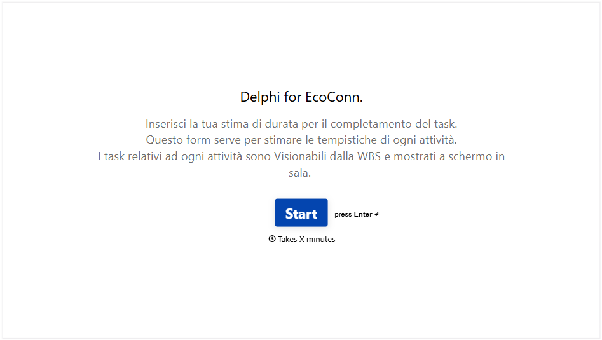
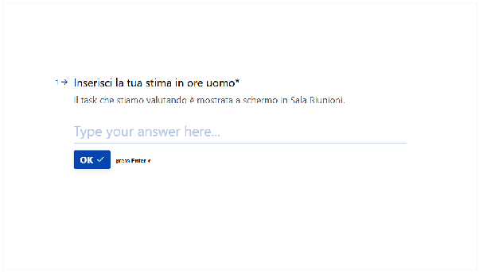
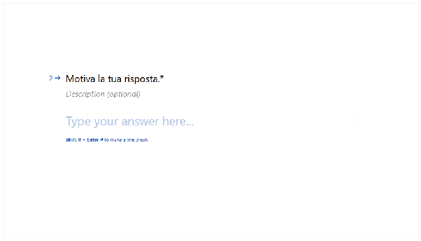

# **Estimating task duration**

# Map microservice

| \#3 Backend \[26h\] |
| :---- |
| Sviluppo delle componenti del dominio **\[2h\]** Sviluppo classi e interfacce dei elementi del modello di dominio  **\[2h\]** Il sistema deve permettere la creazioni di piani **\[5.5h\]** Implementazione caricamento della piantina **\[2h\]** Implementazione inserimento delle informazioni del piano  **\[1.5h\]** Test creazione e corretto salvataggio di un piano  **\[1h\]** Test per verificare il corretto formato della piantina **\[1h\]** Il sistema deve permettere di gestire un piano **\[2.5h\]** Implementazione modifica delle informazioni **\[1h\]** Implementazione rimozione del piano.  **\[0.5h\]** Test modifica e rimozione di un piano **\[1h\]** Il sistema deve permettere di creare una zona **\[3h\]** Implementazione salvataggio del poligono **\[1.5h\]** Implementazione inserimento delle informazioni della zona **\[1h\]** Test creazione e corretto salvataggio di una zona **\[0.5h\]** Il sistema deve permettere di associare una zona ad un ospite **\[3h\]** Comunicazione con il microservizio utenti per ottenere tutti gli utenti della residenza **\[1h\]** Comunicazione con il micro servizio utenti per associare la zona **\[1h\]** Test comunicazione con il microservizio utenti **\[0.5h\]** Test per verificare il corretto salvataggio dell’assegnazione **\[0.5h\]** Il sistema deve permettere di gestire una zona  **\[2.5h\]** Implementazione modifica delle informazioni **\[1h\]** Implementazione rimozione della zona.  **\[0.5h\]** Test modifica e rimozione di una zona **\[1h\]** Il sistema deve permettere di posizionare gli EH **\[3h\]** Comunicazione con il microservizio EH per ottenere tutti gli EH **\[1h\]** Comunicazione con il microservizio EH per associare una zona **\[1h\]** Test comunicazione con il microservizio EH  **\[0.5h\]** Test per verificare il corretto salvataggio dell’assegnazione **\[0.5h\]** Il sistema deve permettere di modificare gli EH **\[2.5h\]** Implementazione modifica della posizione  **\[1h\]** Implementazione rimozione del EH **\[0.5h\]** Test modifica e rimozione **\[1h\]**	 Test di verifica del microservizio **\[4h\]** Verifica rispetto dei requisiti **\[2h\]**	 Verifica architettura  **\[2h\]**	 |

| \#3.5 Approvazione Backend \[4h\] |
| :---- |
| Revisione del codice e controllo dei test **\[4h\]** |

| \#4 Frontend \[20h\] |
| :---- |
| Implementazione pagina di setup iniziale **\[2.5h\]** Implementazione template **\[1h\]** Implementazione step indicator **\[0.5h\]** Implementazione navigazione tra gli step **\[1h\]** Implementazione pagina di configurazione dei piani **\[9h\]** Implementazione caricamento piantina **\[2h\]** Implementazione form per inserimento delle informazioni **\[2h\]** Implementazione modifica del piano **\[1h\]** Implementazione eliminazione del piano **\[1h\]** Test di verifica del formato della piantina **\[1h\]** Testi di verifica delle informazioni **\[2h\]** Implementazione pagina di configurazione delle zone **\[7.5h\]** Implementazione editor per creare poligoni all’interno della piantina **\[1h\]** Implementazione form per inserimento delle informazioni **\[1h\]** Implementazione modifica della zona **\[1h\]** Implementazione editor per rimuovere i poligoni dalla piantina **\[1h\]** Implementazione eliminazione della zona **\[0.5h\]** Testi di verifica delle informazioni **\[2h\]** Implementazione recupero degli ospiti **\[1h\]** Implementazione associazione zona ad un ospite **\[1h\]** Implementazione pagina di configurazione degli EH **\[4h\]** Implementazione recupero degli EH **\[1h\]** Implementazione editor per posizionare elementi nella piantina **\[1h\]** Implementazione editor per rimuovere elementi dalla piantina **\[2h\]** Test con focus group per verificare l’UI e UX **\[1.5h\]**	 |

| \#3.5 Approvazione Frontend \[1.5h\] |
| :---- |
| Navigazione all’interno del micro servizio tramite focus group per validare il lavoro svolto **\[1.5\]** |

# Stima di ogni attività

Formazione **\[8h\]**

# Shared kernel **\[16h\]**

Frontend **\[20h\]**
Auth microservice:

- Test SSO RR **\[4h\]**
- Progettazione  **\[6.5h\]**
- Setup **\[5.5h\]**
- Backend **\[16h\]**
- Approvazione Backend **\[4h\]**
- Frontend **\[8h\]**
- Integrazione Backend e Frontend **\[1.5h\]**

User microservice:

- Progettazione **\[6.5h\]**
- Setup **\[5.5h\]**
- Backend **\[10h\]**
- Approvazione Backend **\[4h\]**
- Integrazione con Auth microservice **\[1.5h\]**

Map microservice:

- Progettazione **\[6.5h\]**
- Setup **\[5.5h\]**
- Backend **\[26h\]**
- Approvazione Backend **\[4h\]**
- Frontend **\[20h\]**
- Approvazione Frontend **\[1.5h\]**
- Sviluppo editor **\[8h\]**
- Integrazione Backend e Frontend **\[1.5h\]**
- Integrazione con Auth microservice **\[1.5h\]**
- Integrazione con User microservice **\[1.5h\]**

Monitoring microservice:

- Progettazione **\[6.5h\]**
- Setup **\[5.5h\]**
- Backend  **\[14h\]**
- Approvazione Backend **\[4h\]**
- Frontend  **\[12h\]**
- Approvazione Frontend **\[1.5h\]**
- Integrazione Backend e Frontend **\[1.5h\]**
- Integrazione con User microservice **\[1.5h\]**

Forecasting microservice:

- Progettazione **\[6.5h\]**
- Setup **\[5.5h\]**
- Sviluppo algoritmo di forecasting **\[24h\]**
- Backend **\[12h\]**
- Approvazione Backend **\[4h\]**
- Frontend **\[8h\]**
- Integrazione Backend e Frontend **\[1.5h\]**
- Integrazione con Monitoring microservice **\[1.5h\]**
- Integrazione con User microservice **\[1.5h\]**

Alerting microservice:

- Progettazione **\[6.5h\]**
- Setup **\[5.5h\]**
- Backend  **\[8h\]**
- Approvazione Backend **\[4h\]**
- Frontend **\[8h\]**
- Approvazione Frontend **\[1.5h\]**
- Integrazione Backend e Frontend **\[1.5h\]**
- Integrazione con Forecasting microservice **\[1.5h\]**

Mansion microservice:

- Progettazione **\[6.5h\]**
- Setup **\[5.5h\]**
- Backend **\[10h\]**
- Approvazione Backend **\[4h\]**
- Frontend **\[10h\]**
- Integrazione Backend e Frontend **\[1.5h\]**
- Integrazione con Map microservice **\[1.5h\]**

Installazione **\[32h\]**

# Delphi

	

Vista principale del diagramma Delphi.

	
	

Dettagli aggiuntivi del lavoro di stima.

