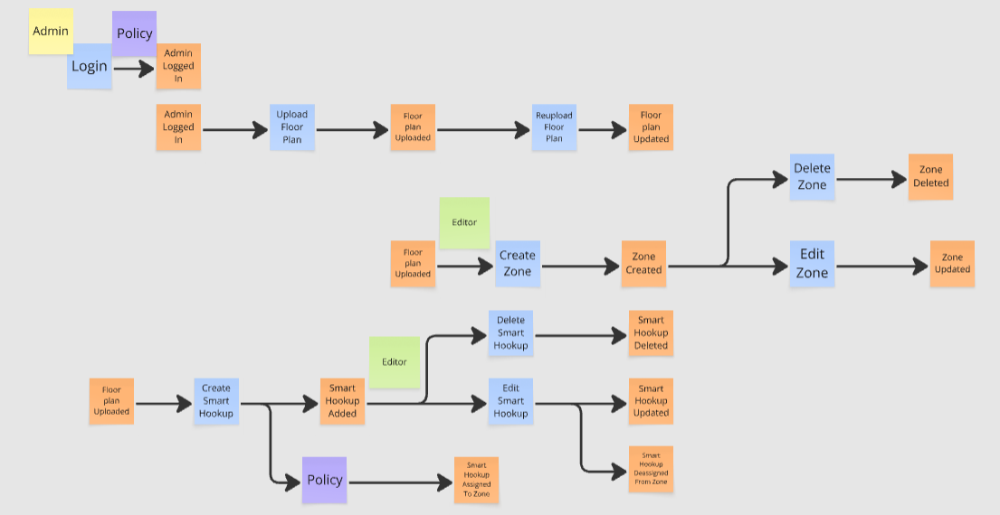
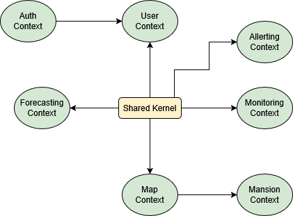

# Riepilogo meeting 2.5.2: “Analisi dei dominio”
## Partecipanti
- PM
- Architetto
- Team di sviluppo

Nella seconda parte del meeting, insieme al team di sviluppo software, l’architetto ha condotto una sessione di event storming per modellare la nuova piattaforma, avvalendosi della lavagna presente nella sala riunioni, post-it colorati e pennarelli. Durante l’attività sono stati posizionati nella lavagna i post-it colorati che indicavano:

- Arancione: gli eventi del dominio
- Blu: comandi per eseguire azioni o gli eventi del dominio
- Giallo: gli attori che eseguono i comandi
- Verde: le interfacce per eseguire i comandi
- Viola: le logiche di business automatiche

In fondo viene riportato un esempio di una parte del sistema modellata durante il meeting ricostruita utilizzando il tool “Miro”. Questa sessione ha permesso sia al team di sviluppo che all’architetto e PM di avere una comprensione completa del dominio applicativo e del funzionamento complessivo della nuova piattaforma. Inoltre durante il meeting sono stati discussi alcuni use case degli elementi nuovi  da definire, i quali verranno successivamente tradotti in mockup da sottoporre all’approvazione del cliente e del focus group. Al termine dell’attività, sono stati infine delineati i Bounded Context, che definiscono le singole aree funzionali della piattaforma, e la Context Map, che definisce la relazione tra i vari contesti. L’analisi del dominio risulta quasi completamente definita. La formalizzazione della Context Map, comprensiva della descrizione degli eventi, dei comandi e delle modalità di comunicazione tra i Bounded Context, è stata rimandata alla fase di progettazione vera e propria, che sarà avviata solo in caso di conferma del progetto. Trattandosi di un’attività complessa e propedeutica alla definizione delle componenti architetturali, si ritiene opportuno che venga inclusa nelle attività contrattualizzate e retribuite previste per la fase di lancio.

## Documenti prodotti
### **Event storming**
Esempio di una parte dell’event storming che modella l’inserimento della piantina di un piano, la successiva divisione in zone e il posizionamento degli EH nella mappa.

	

Ricostruzione Miro di una porzione dell'event storming.

### **Bounded context**
L’analisi del dominio termina con la separazione dei contesti e con la definizione del “shared kernel” che conterà la logica comune tra i contesti. Tali contesi verranno poi tradotti in microservizi:

- **Auth Context**: responsabile della comunicazione con il SSO di RR per l’autenticazione e l’autorizzazione degli utenti
- **User Context**: responsabile della gestione delle informazioni sugli utenti
- **Map Context**: responsabile della gestione delle piantine, delle zone e della posizione e stato dei EH
- **Monitoring Context**: responsabile della raccolta e memorizzazione dei dati grezzi di consumo provenienti da ciascun EH, oltre che a fornire i dati per i contatori e i grafici
- **Forecasting Context**: responsabile della gestione della previsione dei consumi delle utenze
- **Alerting Context**: responsabile dell’invio di notifiche agli ospiti quando i consumi attuali superano quelli previsti
- **Mansion Context**: responsabile della gestione delle residenze

	

Schema dei bounded context individuati durante l'analisi del dominio.

### ---
